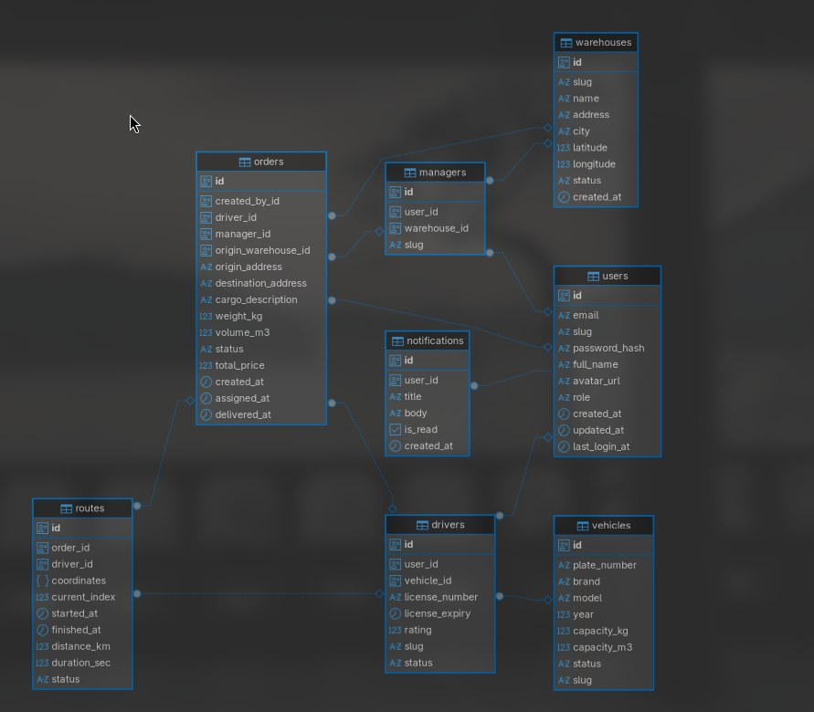

# Logiflow

Бэкенд для логистической платформы. Управление заказами на перевозку, водителями, транспортом и складами. При создании заказа строится реальный маршрут через OSRM, считается стоимость перевозки, трекинг водителя в реальном времени через WebSocket.

Репозиторий: [github.com/anxi0uz/logiflow](https://github.com/anxi0uz/logiflow)

## Стек

- **Go 1.25** — Chi v5, oapi-codegen, pgx/v5, go-redis, errgroup
- **PostgreSQL** — миграции через Goose
- **Redis** — хранение JWT access/refresh токенов
- **Nominatim** — геокодинг адресов (OpenStreetMap, без ключа)
- **OSRM** — построение маршрутов и расчёт дистанции
- **Prometheus + Grafana** — мониторинг HTTP метрик
- **Podman** — контейнеризация

## Запуск

### Зависимости

**Linux:**
- [Podman](https://podman.io/docs/installation) + [podman-compose](https://github.com/containers/podman-compose)

```bash
# Arch
sudo pacman -S podman
pip install podman-compose
# Или
yay -S podman-compose

# Ubuntu/Debian
sudo apt install podman
pip install podman-compose
```

**Windows:**
- [Docker Desktop](https://www.docker.com/products/docker-desktop/) — включает docker-compose

---

### 1. Клонировать репозиторий

```bash
git clone https://github.com/anxi0uz/logiflow.git
cd logiflow
```

---

### 2. Заполнить `.env`

В корне проекта уже есть `.env` — просто заполни значения:

```env
LOGIFLOW_DATABASE_USER=logiflow
LOGIFLOW_DATABASE_PASSWORD=yourpassword
LOGIFLOW_DATABASE_NAME=logiflow
LOGIFLOW_REDIS_PASSWORD=yourredispassword
LOGIFLOW_JWT_KEY=your-secret-jwt-key-min-32-chars
```

> `LOGIFLOW_JWT_KEY` — любая случайная строка, минимум 32 символа.

---

### 3. Создать сеть (только Linux / Podman)

```bash
podman network create LogiflowNetwork
```

На Windows Docker создаёт сеть автоматически — этот шаг пропускай.

---

### 4. Запустить

**Linux (Podman):**
```bash
make up        # запуск
make build-up  # пересборка образа + запуск
make down      # остановка
make deploy    # pull + пересборка + запуск (для деплоя)
```

**Windows (Docker):**
```bat
docker compose up -d
docker compose build && docker compose up -d
docker compose down
```

Миграции БД применяются **автоматически** при старте приложения — делать ничего не нужно.

---

### 5. Проверить

Открыть в браузере `http://localhost:3001/metrics` — если страница отвечает, сервер поднят.

## Сервисы

| Сервис | Адрес |
|---|---|
| API | `http://localhost:3001` |
| Grafana | `http://localhost:3000` |
| Prometheus | `http://localhost:9090` |
| Метрики | `http://localhost:3001/metrics` |

## Конфигурация

Конфиг читается из `configs/config.toml`, переменные окружения с префиксом `LOGIFLOW_` перекрывают файл.

```toml
[server]
host         = "0.0.0.0"
port         = 3001
readTimeout  = "10s"
writeTimeout = "30s"
idleTimeout  = "60s"

[redis]
refreshTokenTTL = "168h"
accessTokenTTL  = "24h"

[pricing]
baseFee = 500.0   # базовая ставка, руб
perKm   = 25.0    # руб/км
perKg   = 3.0     # руб/кг
perM3   = 150.0   # руб/м³
```

Цена заказа считается по формуле:
```
total = baseFee + distance_km * perKm + weight_kg * perKg + volume_m3 * perM3
```

## Роли

| Роль | Возможности |
|---|---|
| `client` | Создаёт и отменяет свои заказы, следит за статусом |
| `driver` | Меняет свой статус, видит назначенные заказы, двигает статус in_transit/delivered |
| `manager` | Назначает водителей на заказы, управляет статусами, смотрит отчёты |
| `admin` | Создаёт профили водителей, видит всё |

Клиенты регистрируются через `POST /auth/register`. Роль назначается вручную в БД. Водителей создаёт `admin`, менеджеров — авторизованный пользователь.

## Авторизация

JWT (HS256) + refresh токены. Access токен живёт 24 часа, refresh — 7 дней в HTTP-only cookie. Оба хранятся в Redis — при логауте удаляются.

```
Authorization: <access_token>
```

## API

### Auth
| Метод | Путь | Описание |
|---|---|---|
| POST | `/auth/register` | Регистрация клиента |
| POST | `/auth/login` | Вход, получение токенов |
| POST | `/auth/logout` | Выход, инвалидация токенов |
| POST | `/auth/refresh` | Обновление access токена |

### Пользователь
| Метод | Путь | Описание |
|---|---|---|
| GET | `/me` | Профиль текущего пользователя |
| PATCH | `/me` | Обновить имя, аватар, пароль |
| DELETE | `/me` | Удалить аккаунт |
| GET | `/me/trips` | История поездок (driver) |

### Заказы
| Метод | Путь | Описание |
|---|---|---|
| GET | `/orders` | Список заказов (по роли) |
| POST | `/orders` | Создать заказ |
| GET | `/orders/{id}` | Получить заказ |
| DELETE | `/orders/{id}` | Отменить заказ |
| PATCH | `/orders/{id}/status` | Обновить статус |
| GET | `/orders/{id}/route` | Маршрут заказа |
| GET | `/orders/{id}/route/ws` | WebSocket трекинг |

### Водители
| Метод | Путь | Описание |
|---|---|---|
| GET | `/drivers` | Список водителей |
| POST | `/drivers` | Создать водителя (admin) |
| GET | `/drivers/{slug}` | Получить водителя |
| PUT | `/drivers/{slug}` | Обновить водителя |
| DELETE | `/drivers/{slug}` | Удалить водителя |
| PATCH | `/drivers/me/status` | Обновить свой статус (driver) |

### Менеджеры
| Метод | Путь | Описание |
|---|---|---|
| GET | `/managers` | Список менеджеров |
| POST | `/managers` | Создать менеджера |
| GET | `/managers/{slug}` | Получить менеджера |
| DELETE | `/managers/{slug}` | Удалить менеджера |

### Склады
| Метод | Путь | Описание |
|---|---|---|
| GET | `/warehouses` | Список складов |
| POST | `/warehouses` | Создать склад |
| GET | `/warehouses/{slug}` | Получить склад |
| PUT | `/warehouses/{slug}` | Обновить склад |
| DELETE | `/warehouses/{slug}` | Удалить склад |

### Транспорт
| Метод | Путь | Описание |
|---|---|---|
| GET | `/vehicles` | Список ТС |
| POST | `/vehicles` | Добавить ТС |
| GET | `/vehicles/{slug}` | Получить ТС |
| PUT | `/vehicles/{slug}` | Обновить ТС |
| DELETE | `/vehicles/{slug}` | Удалить ТС |

### Отчёты
| Метод | Путь | Описание |
|---|---|---|
| GET | `/reports/orders` | Отчёт по заказам (manager) |
| GET | `/reports/dashboard` | Дашборд (manager) |

### Уведомления
| Метод | Путь | Описание |
|---|---|---|
| GET | `/notifications` | Список уведомлений |
| PATCH | `/notifications/{id}/read` | Отметить прочитанным |

## Флоу заказа

```
Клиент создаёт заказ (адреса → Nominatim → координаты → OSRM → маршрут)
  ↓
Менеджер назначает водителя (pending → assigned)
  ↓
Водитель начинает поездку (assigned → in_transit)
  ↓
Трекинг по WebSocket — current_index двигается по массиву координат
  ↓
Водитель завершает (in_transit → delivered)
```

## Структура БД

```
users
  ├── drivers (user_id) → vehicles
  └── managers (user_id) → warehouses

orders (created_by_id → users, driver_id → drivers, manager_id → managers)
  └── routes (order_id) — JSONB координаты маршрута, current_index

notifications (user_id → users)
```

## Мониторинг

Prometheus собирает метрики с `/metrics`. Grafana доступна на `localhost:3000` (admin/admin).

Доступные метрики:
- `logiflow_http_requests_total` — кол-во запросов по методу, пути, статусу
- `logiflow_http_duration_seconds` — latency запросов

Конфиг Prometheus: `configs/prometheus.yml`
Datasource Grafana: `configs/datasources/`

## Тесты

Юнит тесты хендлеров через `httptest` без реальной БД:

```bash
go test ./tests/...
```
